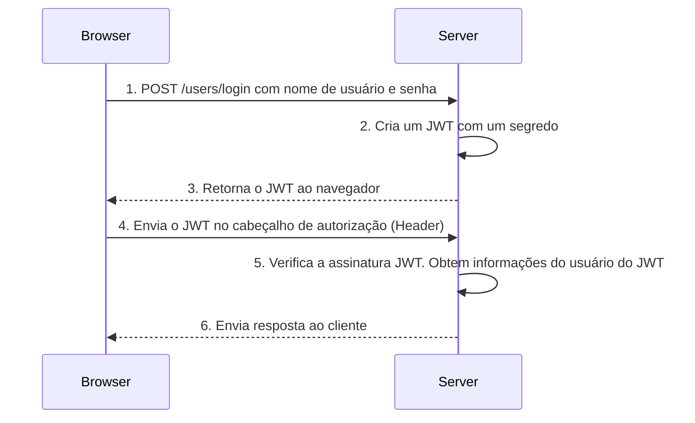


## JSON Web Token (JWT) 🔐

JSON Web Token (JWT) é um meio compacto e seguro para URLs de representar declarações (claims) a serem transferidas entre duas partes.


As declarações em um JWT são codificadas como um objeto JSON que é usado como o payload de uma estrutura JSON Web Signature (JWS) ou como o texto simples de uma estrutura JSON Web Encryption (JWE), permitindo que as declarações sejam assinadas digitalmente ou protegidas quanto à integridade com um Código de Autenticação de Mensagem (MAC) e/ou criptografadas.

### Um token JWT consiste em três partes:

1. **Cabeçalho (header)** - objeto json que define o tipo de token e o algoritmo de criptografia usado;

2. **Carga útil(payload)** - objeto josn contendo as claims;

3. **Assinatura(signature)** - É a concatenação dos hashes gerados a partir do Header e do PayLoad;


   
#ParaTodosVerem

Um diagrama ilustra a estrutura de um token JWT (JSON Web Token), mostrando as seções de cabeçalho, carga útil e assinatura.  
O diagrama apresenta três blocos retangulares: cabeçalho, carga útil e assinatura.  O cabeçalho, carga útil e assinatura são apresentados como blocos retangulares preenchidos. Cada bloco contém dados em formato JSON, com as chaves e valores representando as informações do token JWT. As setas indicam a relação entre as partes, mostrando como o cabeçalho e a carga útil são usados para gerar a assinatura.

O cabeçalho **(header)** contém informações sobre o tipo de token e o algoritmo usado para criar a assinatura.

```bash
{
"alg":"HS246",
"typ": "JWT"
}
```

A carga útil **(payload)** contém dados sobre o usuário, como identificador de usuário e nome, bem como outras informações relevantes.

```bash
{
"sub":"1234567890",
"name": "George White",
"admin":"true",
"iat": "151623022"
}
```

A assinatura **(signature)** garante a autenticidade e integridade do token.

```bash
Base64URLSafe(
HMACSHA256(<header>.
<payload>, <secret key>
))
```
Ao contrário dos cookies, que são passados ​​automaticamente para o servidor, o token JWT precisa ser explicitamente passado para o servidor pelo cliente.

Então, um fluxo simplificado de operações seria o seguinte:



#ParaTodosVerem

1- O cliente envia credenciais de segurança, como nome de usuário e senha, para o servidor para validação;   
2- O servidor valida o nome de usuário e a senha;   
3- Se as credenciais forem válidas, o servidor gera e emite um token JWT para o cliente;   
4- O cliente recebe o token e o armazena em algum lugar;   
5- Ao solicitar qualquer recurso ou ação do servidor, o cliente adiciona o token JWT emitido anteriormente no cabeçalho Authorization da requisição;   
6- O servidor lê o cabeçalho de autorização para recuperar o token JWT;   
7- Se o token for válido, o servidor executará a ação solicitada pelo cliente;

Então, basta pensar no token JWT como um ticket. Se a requisição recebida tiver um ticket válido, ela poderá acessar um recurso.

## Implementação

Para implementar a autenticação baseada em JWT, precismos executar as seguintes etapas:

1- Armazenar os detalhes do JWT em um arquivo de configuração.  
2- Ativar o esquema de autenticação JWT na inicialização do aplicativo.  
3- Criar algum mecanismo que valide o nome de usuário e a senha e emita um token JWT.  
4- Crie uma API protegida (Authorize)   
5- Invocar a API de um cliente usando o token 

## Referências

https://www.macoratti.net/19/06/aspnc_autjwt1.htm  

https://datatracker.ietf.org/doc/html/rfc7519

________________________________________________________________________________________________________________________________________________________________________

# Testes Unitários com JUnit e Mockito 🧪

  Testes unitários são uma técnica essencial para garantir a qualidade do software. Eles permitem identificar erros precocemente, facilitam a refatoração e incentivam um design de código mais limpo e modular. A ideia principal é testar pequenas partes do código (unidades) de forma isolada, assegurando que cada uma funcione como esperado.

## O que são Testes Unitários?
  Testes unitários são pequenos trechos de código que verificam se uma funcionalidade específica de um sistema está funcionando corretamente. Eles são escritos pelos desenvolvedores para validar o comportamento de métodos ou classes individuais.

## Benefícios dos Testes Unitários:
   - **Detecção precoce de erros**: Identifica problemas antes que o código seja integrado ao sistema.
   - **Facilidade na refatoração**: Garante que alterações no código não quebrem funcionalidades existentes.
   - **Melhoria no design do código**: Incentiva a modularidade e a separação de responsabilidades.
   - **Confiança no software**: Aumenta a segurança de que o sistema está funcionando corretamente.

## Frameworks de Testes
 No ecossistema Java, dois frameworks se destacam para a criação e execução de testes unitários:
 - **JUnit**: Framework mais utilizado para estruturar e organizar testes unitários. Ele fornece anotações e métodos que tornam os testes mais claros e padronizados.
 - **Mockito**: Biblioteca para simular comportamentos de objetos reais (mocks), permitindo isolar dependências e focar na unidade de código em teste.

## Estrutura de um Teste Unitário

  Um teste unitário geralmente segue três etapas principais:

  **Configuração (Arrange):**  
  Nesta etapa, o cenário do teste é preparado. Isso inclui a inicialização de objetos, configuração de dependências e definição de comportamentos esperados para os mocks. O objetivo é criar um ambiente controlado para o teste.

  **Execução (Act):**  
  Aqui, a ação que será testada é executada. Normalmente, isso envolve chamar o método ou funcionalidade que está sendo validada.

  **Validação (Assert):**  
  Embora não seja o foco principal aqui, a validação é onde os resultados da execução são comparados com os valores esperados. Isso garante que o comportamento do código está correto.

  # Simulação de Dependências com Mockito

  O Mockito é uma ferramenta poderosa para criar mocks, que são objetos simulados usados para isolar a unidade de código em teste. Ele permite que você controle o comportamento de dependências externas, como repositórios ou serviços, sem precisar de implementações reais.

  **Principais anotações do Mockito:**
  - `@Mock`: Cria mocks das dependências que serão simuladas.
  - `@InjectMocks`: Injeta automaticamente os mocks nas dependências da classe que está sendo testada.

  **Exemplo prático:**  
  Imagine que você tem um serviço de usuários que depende de um repositório para salvar e buscar dados. Com o Mockito, você pode simular o comportamento do repositório para testar o serviço de forma isolada.

  ```java
        @RunWith(MockitoJUnitRunner.class)
        public class UserServiceTest {

            @Mock
            private UserRepository userRepository;

            @InjectMocks
            private UserService userService;

            @Test
            public void testCreateUser() {
                // Configuração (Arrange)
                UserEntity user = new UserEntity();
                user.setName("Fulano");
                user.setEmail("fulano@example.com");
                when(userRepository.save(user)).thenReturn(user);

                // Execução (Act)
                UserEntity createdUser = userService.createUser(user);

            }

            @Test
            public void testGetUserById() {
                // Configuração (Arrange)
                UserEntity user = new UserEntity();
                user.setId(1L);
                user.setName("Fulano");
                user.setEmail("fulano@example.com");
                when(userRepository.findById(1L)).thenReturn(Optional.of(user));

                // Execução (Act)
                UserEntity foundUser = userService.getUserById(1L);

            }
        }
  
 ```

## Boas Práticas
Para garantir a eficácia dos testes unitários, siga estas boas práticas:
- **Independência**: Cada teste deve ser isolado, sem depender de outros.
- **Legibilidade**: Use nomes claros e organize o código para facilitar a leitura.
- **Rapidez**: Testes devem ser rápidos para não atrasar o desenvolvimento.
- **Especificidade**: Cada teste deve validar apenas uma funcionalidade.
- **Cobertura**: Certifique-se de cobrir todas as funcionalidades relevantes.

## Cobertura de Código
   A cobertura de código mede a porcentagem do código-fonte que é executada pelos testes unitários. Essa métrica ajuda a identificar partes do código que não estão sendo testadas.

### Benefícios da Cobertura de Código:
- **Confiança na qualidade do software**: Uma cobertura alta indica que a maioria das funcionalidades foi testada.
- **Redução de riscos**: Diminui a probabilidade de bugs em áreas críticas do sistema.

#### Ferramenta recomendada:
- **JaCoCo**: Um plugin que gera relatórios detalhados sobre a cobertura de código.

## Implementação
Para implementar testes unitários com JUnit e Mockito, siga estas etapas:
1. **Configurar o ambiente de testes**:
- Adicione as dependências do JUnit e Mockito no arquivo de configuração do projeto (por exemplo, `pom.xml`).
- Certifique-se de que o ambiente de build esteja configurado para executar os testes.
2. **Criar classes de teste**:
- Para cada classe ou funcionalidade do sistema, crie uma classe de teste correspondente.
- Use anotações como `@Test` para identificar os métodos de teste.
3. **Simular dependências com Mockito**:
- Use a anotação `@Mock` para criar mocks das dependências.
- Injete os mocks na classe que está sendo testada com `@InjectMocks`.

## Conclusão
 Testes unitários são fundamentais para a construção de softwares confiáveis e de alta qualidade. Com frameworks como JUnit e Mockito, é possível criar testes eficazes que garantem a funcionalidade e a manutenção do código. Além disso, ferramentas como JaCoCo ajudam a monitorar a eficácia dos testes, mas o foco principal deve ser a qualidade e a clareza dos testes escritos.

Seguindo boas práticas e implementando testes de forma estruturada, você pode reduzir o risco de bugs, melhorar a qualidade do software e garantir um desenvolvimento mais seguro e eficiente.

## Referências
- [Testes Unitários com JUnit e Mockito - Higo Ab Silva](https://higoabsilva.medium.com/testes-unit%C3%A1rios-com-junit-e-mockito-descomplicando-fc44aa596be7)
- [Explorando Testes Unitários com JUnit 5 e Mockito - Diego Brandão](https://dev.to/diegobrandao/explorando-testes-unitarios-com-junit-5-e-mockito-um-exemplo-pratico-2am5)
- [Teste Unitário com JUnit - DevMedia](https://www.devmedia.com.br/teste-unitario-com-junit/41235)
- [JaCoCo - Documentação Oficial](https://www.eclemma.org/jacoco/trunk/doc/maven.html)
- **Aula**: 25/02/2025 - Testes Unitários
